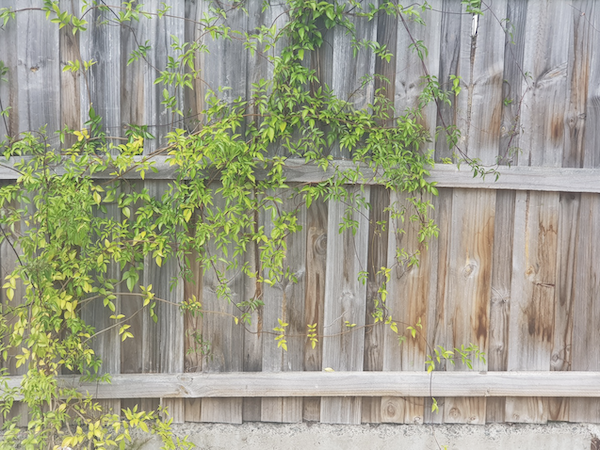

# classification-patch-base-system

## INTRODUCTION

Machine learning has been very successfull for many years. It could have successfully solved many challanges such as detection of tumors from brain image [1], segmentation of problematic area [2], and classification of certain image [3]. However, supervised learning methodology has a fundamental limitation due to its dependancy to the given label [4]. Since the learning is based on the given label, it is even more serious especially when the label is ambiguous [5]. However, it is hard to blame the label itself because, in many cases, it is very difficult to provide clear label due to the feature of given image data. Here are the challenge I prepared:

## CHALLANGE

 \
I have a wooden fence with full of climbing plants in my house. \
I want to quantitate the coverage of the vegetation. \
So I made label like below ↓↓↓

 \
**However**, the label (green mask) includes the wall area as well which is not desirable because the wall area is obviously non-vegetation. If the wall area is included in the training, the model will learn the false information and the consequence will be not welcomed. But it also takes considerably extensive amount of time and labour to annotate only vegetation avoiding all the wall area. Therefore, it is generally very hard to expect to get 100% decent label data with finely carved every single edge. This happens a lot especially when you collaborate with other data providers. So I believe this must be overcome by the power of algorithm. To break this challange, here I implemented ambiguous data-resistant patch-based classification:

## OVERVIEW of the algorithm
 `Green Patch = Vegetation` \
 `Red Patch = Wall` \

 Automatic calculation of the coverage of vegetation by classifying every patch from the given image! you can adjust patch size to allow classification model to perform more detailed manner 

The final outcome will be articulated in below ↓↓↓

## ANOTHER CHALLANGE
To provide training dataset for classification algorithm, you must decide vegetation and non-vegetation(wall) from cropped images. Let's see some of the cropped images. \
 \
⬆ This picture looks obvious. ⬆ \
These cropped patches are defintely **'vegetation'**. \
\
 \
⬆ Also, these examples are obviously in the **'wall'** group. ⬆ \
\
 \
⬆ What about these? ⬆ \
Eventhough it looks bit 'less vegie', it is still agreeable to be **'vegetation'** group \
\
 \
⬆ Then what about these? ⬆ \
Will you put these in the **'vegetation'** group? or **'wall'** group? \
Here is the dilemma. If you include these to 'vegetation' group, the model will learn **'wall'** pixels data as well.\
However, if you include these to **'wall'** group, the opposite thing will happen. \
\
 \
⬆ Now, What about these? ⬆ \ 
Will you put these patches to which group? **Vegetation?** or **Wall?** \
\
As you can see. It's hard to decide like when you ... ↓
  
 

<!--
So, I will let these be decided by algorithm by voting from inside of the patches!
To lower the work overload, this vote will happens only when the classification confidence of the patch is lower than a certain thresh hold
-->

## DATA OVERVIEW

  
* **images** : `2694 cropped images`
* **original image size** : `1440 x 1080`
* **patch size** : `45 x 45`
* **patches per image (original)** : `768 (;32 x 4)`

## AUGMENTATION
* RandomFlip("horizontal_and_vertical"),
* RandomRotation(0.3)
* RandomBrightness(factor=0.2)
* RandomContrast(factor=0.2)

## TRAINING DETAIL
[See this Jupyter Notebook](train.ipynb)

## TEST RESULT

## CONCLUSION
This would be useful when you want...
* to get coverage of a certain type of object within a picture
* to distinguish background

## DATA AVAILABILITY
* Vegetation image data will be available upon request (email me : jcjc7890@gmai.com)

## RELATED PROJECT
Beggiatoa coverage estimation based on patch-base classification.  
https://github.com/boguss1225/beggiatoa_coverage_estimation

## REFERENCE
[0] Keras docs : https://keras.io/examples/vision/image_classification_from_scratch/   
[1] Zhao, X., Wu, Y., Song, G., Li, Z., Zhang, Y., & Fan, Y. (2018). A deep learning model integrating FCNNs and CRFs for brain tumor segmentation. Medical image analysis, 43, 98-111. 
[2] Yoon, H., Park, M., Yeom, S., Kirkcaldie, M. T., Summons, P., & Lee, S. H. (2021). Automatic detection of amyloid beta plaques in somatosensory cortex of an Alzheimer’s disease mouse using deep learning. IEEE Access, 9, 161926-161936. 
[3] Loussaief, S., & Abdelkrim, A. (2016, December). Machine learning framework for image classification. In 2016 7th International Conference on Sciences of Electronics, Technologies of Information and Telecommunications (SETIT) (pp. 58-61). IEEE 
[4] Wang, J., Yang, Y., Mao, J., Huang, Z., Huang, C., & Xu, W. (2016). Cnn-rnn: A unified framework for multi-label image classification. In Proceedings of the IEEE conference on computer vision and pattern recognition (pp. 2285-2294). 
[5] Schmarje, L., Grossmann, V., Zelenka, C., Dippel, S., Kiko, R., Oszust, M., ... & Koch, R. (2022). Is one annotation enough? A data-centric image classification benchmark for noisy and ambiguous label estimation. arXiv preprint arXiv:2207.06214. 
